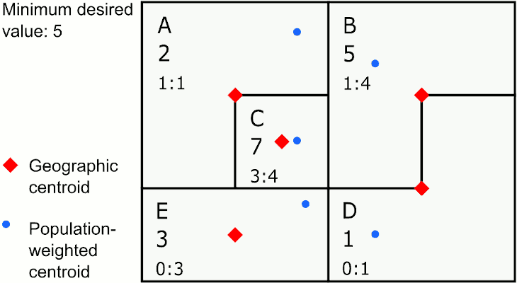
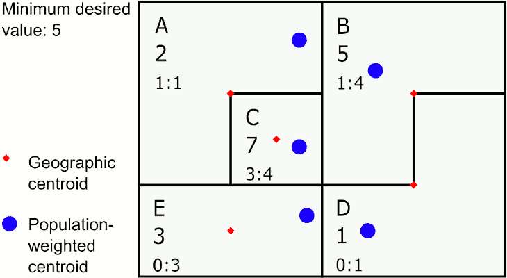
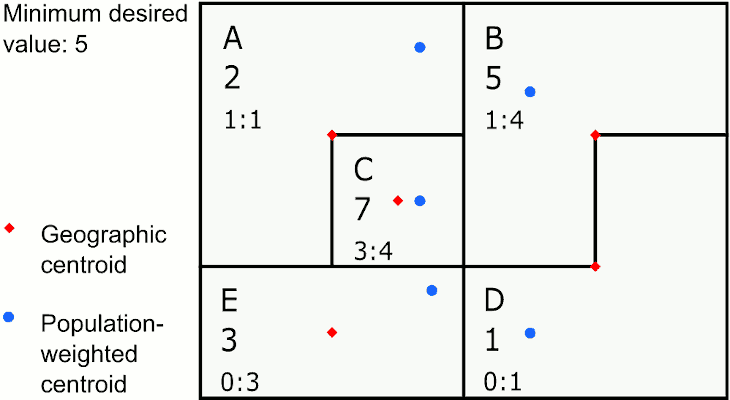
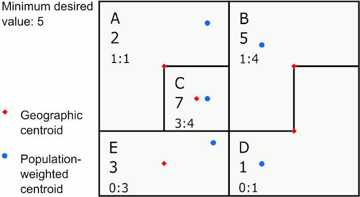
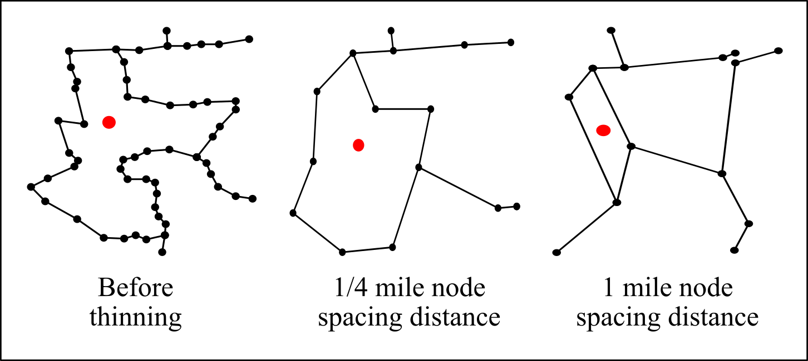
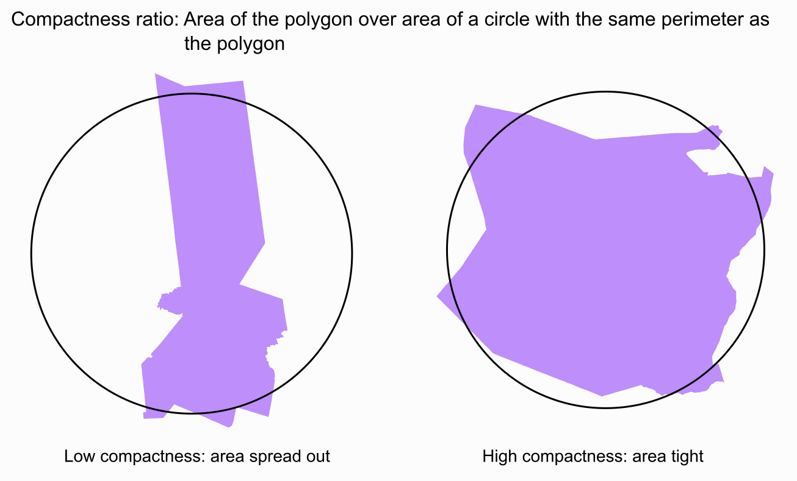

```{r, include = FALSE}
knitr::opts_chunk$set(
  collapse = TRUE,
  comment = "#>"
)
```

# GAT overview 

This package is maintained by the New York State Department of Health (NYSDOH) Environmental Public Health Tracking (EPHT) program. The purpose of this package is to run the Geographic Aggregation Tool (GAT) in R. 

Health outcome maps with fine geographic resolution can be misleading due to random fluctuations in disease rates caused by small numbers. In some cases, these maps can also inadvertently disclose confidential data. To overcome these limitations NYSDOH EPHT developed GAT to join neighboring geographic areas together until a user defined population and/or number of cases is reached. GAT can be used to produce maps for the public at the finest geographic resolution practicable.
    
The input object is a shapefile (*.shp). For shapefile requirements, see [Preparing your shapefile for GAT](gat_prepare_shapefile.html). At minimum, GAT requires a polygon shapefile with a character variable that uniquely identifies areas and a numeric variable to sum for aggregation. 

A series of dialog boxes allows the user to select: a variable to uniquely identify areas, one or more aggregation variables, optionally, a variable of areas within which merging will be preferred (ex. county), the amount (sum) the aggregation variable(s) should be aggregated to, and the preferred aggregation method - closest, least value, or ratio. 

The output includes: a crosswalk shapefile, an aggregated shapefile with associated data, a PDF with several maps, a comprehensive log, and if requested a KML file. For output regions, most numeric variables will be summed, except variables with the following names, which will be averaged instead: x, y, GATx, GATy, lat, lon, latitude, longitude, and long. Values of character variables will be concatenated. The shapefile can be used in ArcGIS, MapInfo, and QGIS. The KML file can be displayed in Google Earth and other Internet-based mapping programs.

The package includes two embedded shapefiles to use when testing several of the package functions. For details on these shapefiles, enter `?hftown` or `?hfpop` into the R console. 


# Variables created by GAT

GAT creates several variables in both the original shapefile, which it resaves as a crosswalk, and the aggregated shapefile. These variables are listed below. For the flag variable, a brief data dictionary is provided both below and in the log produced by GAT, to help identify possible issues in the aggregation.

The crosswalk shapefile will have the following variables added:

- **GATflag:** flag of areas that were excluded from aggregation or generated warnings in the log 
    - value = 0: no flag 
    - value = 1: area excluded based on exclusion criteria 
    - value = 5: area excluded because the value of the aggregation variable exceeds the maximum value 
- **GATid:** GAT-generated identifier indicating which aggregated area each original area fell inside

The aggregated shapefile will have the following variables added:

- **GATx:** longitude of the aggregated area centroid (population-weighted if using population weighting, otherwise geographic)
- **GATy:** latitude of the aggregated area centroid (population-weighted if using population weighting, otherwise geographic)
- **GATcratio:** compactness ratio, or the area of the polygon over the area of a circle with the same perimeter 
- **GATnumIDs:** number of original areas that were merged into each aggregated area 
- **GATflag:** flag of areas that were excluded from aggregation or generated warnings in the log 
    - value = 0: no flag 
    - value = 1: area excluded based on exclusion criteria 
    - value = 5: area excluded because the value of the aggregation variable exceeds the maximum value 
    - value = 10: value of the aggregation variable is below minimum value, but there are no eligible areas for further aggregation 
- **GATpop:** population of the aggregated area, from the population file (applies only if population weighting was selected)
- a rate variable with the name the user entered (applies only if rate calculation was requested)


# How GAT identifies areas to merge

The overall goal of the merging is to create a relatively large number of compact regions that meet the specified criteria. To accomplish this, the areas in the input shapefile are aggregated pairwise until all regions have the minimum values specified. 

## Selecting the target area

First, a subset of areas is selected that meets the following restrictions:

* Remove flagged areas (this includes areas indicated by exclusion criteria, with an aggregation value above the maximum, or with no mergeable neighbors)
* Remove areas with the values for *both* aggregation variables above minimum

This results in a subset of areas that all require merging. This subset is reordered from the highest values of the aggregation variable(s) to the lowest. If there is only one aggregation variable, the area with the highest value is merged first. If there is more than one aggregation variable, the process is more complicated. When two aggregation variables are selected, each aggregation variable is divided by the minimum value specified for it. The area with the highest proportion is selected to be aggregated first. 

> For example, given the following:
>
> * minimum for first aggregation variable: 1000 population
> * minimum for second aggregation variable: 100 births
> * first area: 200 population, 90 births
> * second area: 400 population, 50 births
>
> Calculate proportions of area value over minimum value for the first and
> second areas as follows: 
>
> * first area: $\frac{200 population}{1000 minimum population} = 0.2$, 
>   $\frac{90 births}{100 minimum births} = 0.9$  
>   maximum proportion = 0.9
> * second area: $\frac{400 population}{1000 minimum population} = 0.4$, 
>   $\frac{50 births}{100 minimum births} = 0.5$  
>   maximum proportion = 0.5
>
> Of these two areas, the first area has a higher maximum proportion, so it 
> will be merged first.


## Identifying eligible neighbors

After the target area has been identified, GAT generates a list of its neighbors. Areas are considered neighbors if they share at least two points with the selected area. However, not all of these neighbors may be eligible for merging. GAT considers several criteria when selecting eligible areas.

* **Always ineligible:** Flagged areas, which include areas indicated by exclusion criteria or with an aggregation value above the maximum. In addition, when merged, the resulting areas *cannot* have values above the maximum (target area value + merge area value $\ngtr$ maximum value).
* **Adjacent:** The default is for areas to merge only to adjacent areas. To override this, use the option `runGATprogram(adjacent = FALSE)`, which will result in adjacent areas being preferred, but not required. 
* **Inside border:** This option is selected in the dialog boxes. If you select a border, GAT will restrict neighbors only to areas within the border. If there are no eligible neighbors within the border and you used the option `adjacent = FALSE`, GAT will select the closest eligible area within the border, even if it is not adjacent. If you select a border and do not check the box to enforce the border, GAT will consider neighbors outside the border last.
* **Value below minimum:** The default is for GAT to ignore whether the values of neighbors are below the minimum aggregation value. If you want to merge areas whose values are below the minimum aggregation value first, use the option `runGATprogram(minfirst = TRUE)`. If there are no neighbors with aggregation values below the minimum value, GAT will recheck for neighbors without this restriction.

When relaxing eligibility restrictions, GAT drops criteria in this order: Value below minimum (if triggered by `minfirst = TRUE`), Adjacent (only if `adjacent = FALSE`), Inside border (only if border not enforced). If no eligible areas are identified after relaxing these restrictions, the target area is flagged as unable to merge further. For each area for which selection criteria were relaxed, a warning is written to the log.

## Selecting the most eligible neighbor 

If the area does not have adjacent neighbors and you used `adjacent = FALSE`, GAT will default to the closest geographic centroid unless you chose population weighting, in which case it will use the closest population-weighted centroid. If the area has more than one eligible adjacent neighbor, the next few sections cover how the neighbor to merge is selected, depending on the desired merge type.

The new region then becomes a candidate for additional merging, and merging continues until all regions contain the minimum values of the aggregation variables specified or have been flagged as being unable to merge further.


### Closest geographic centroid

The target area is merged with the eligible area with the closest straight-line centroid based on the shape of the area. The new centroid is calculated by averaging the latitudes and longitudes of the two areas. This speeds up GAT considerably, but can result in centroids that do not exactly match the area’s center. 

```{r mergegeo, out.width = '50%', fig.cap = 'Merging by closest geographic centroid', echo = FALSE, fig.alt = 'Animation showing five areas merging by closest geographic centroid'}

```

In the graphic above, the area with the largest value below 5 is E. The closest neighbor to E using geographic centroids is C, so GAT assigns E to merge with C. The next largest value below 5 is in area A, whose closest neighbor is the new area CE, so GAT merges A to CE. The last area below 5 is D, which is closest to B, so GAT merges D with B.

This method provides the most compact areas and can work well for environmental exposures like air pollution and temperature.

### Closest population-weighted centroid

The population file the user selected is used to determine the area's centroid based on the underlying population. The target area is merged with the eligible area with the closest population-weighted centroid. There are two methods for calculating the population-weighted centroid for the new area. The faster method, which is the default, is to calculate the proportion of the population each area contributes to the merged area, then multiply these proportions by their respective latitudes and longitudes and sum the results. For example, if area A contributes 70% of the population and area B contributes 30% of the population, the new longitude would be $0.7 * longitude_A + 0.3 * longitude_B$. The slower method recalculates the centroid of the new area using the underlying populations of both areas in the population file. To access this method, use `runGATprogram(pwrepeat = TRUE)`.

```{r mergepop, out.width = '50%', fig.cap = 'Merging by closest population-weighted centroid', echo = FALSE, fig.alt = 'Animation showing five areas merging by closest population-weighted centroid'}

```

In the graphic above, the area with the largest value below 5 is E. The closest neighbor to E using population-weighted centroids is D, so GAT assigns E to merge with D. The next largest value below 5 is in the new area DE, whose closest neighbor is C, so GAT merges DE to C. The last area below 5 is A, which is closest to B, so GAT merges A with B. 

This method provides areas that may sprawl a bit, but are representative of population centers and can work well for disease rates.

### Neighbor with the least value

If there is only one minimum value specified, the area with lowest value is selected. If there are two minimum values specified, the area with the lowest proportion of aggregation variable to minimum value specified is selected.

```{r mergeleast, out.width = '50%', fig.cap = 'Merging to neighbor with least value', echo = FALSE, fig.alt = 'Animation showing five areas merging to their neighbor with the least value'}

```

In the graphic above, the area with the largest value below 5 is E. E's neighbor with the smallest value is D, so GAT assigns E to merge with D. The next largest value below 5 is in the new area DE, whose neighbor with the smallest value is A, so GAT merges DE to A.

This method provides the largest number of areas and therefore the greatest granularity. However, it can result in weird snaky shapes and possibly donuts, where a rural area entirely surrounds an urban one.

### Neighbor with the most similar ratio

The selected area is merged with the area with the least absolute difference between the ratios of the variables chosen for similarity comparison. For example, suppose the variables chosen for similarity comparison are counts of persons under poverty and total population. If the area to be merged has a percent under poverty of 10%, and it has neighbors have 9%, 13%, and 15% under poverty, then then it would be merged with the area with 9% under poverty. 

```{r mergesimilar, out.width = '50%', fig.cap = 'Merging to neighbor with most similar ratio', echo = FALSE, fig.alt = 'Animation showing five areas merging to their neighbor with the most similar ratio'}

```

In the graphic above, the area with the largest value below 5 is E. E's neighbor with the closest ratio is D, so GAT assigns E to merge with D. The next largest value below 5 is in the new area DE, whose neighbor with the closest ratio is B, so GAT merges DE to B. The last value below 5 is in A, whose neighbor with the closest ratio is C, so GAT merges A to C.

This method works well if you want to create areas of similar populations to investigate social determinants of health.


# Thinning geographic boundaries

The program may merge very slowly if the geographic boundaries are unnecessarily complex. Boundaries can be simplified by a process known as “thinning” (or “simplification” or “integrating” or “generalizing”). Thinning is removing nodes based on how far apart they are and/or their collinearity to decrease the complexity of the maps (see figure below). GIS systems like MapInfo and ArcGIS can be used to thin maps. After thinning, areas should merge much more quickly in the GAT, but the map may appear crude. If high resolution maps are needed for display, the thinned map used for processing data can be linked back to the high resolution boundaries using unique area identifiers.

```{r nodespacing, out.width = '80%', fig.cap = 'Comparing detail as nodes are thinned', echo = FALSE, fig.alt = 'Example of three decreasing levels of detail as nodes are thinned'}

```

# Compactness ratio

The compactness ratio is a measure used to assess how well areas were aggregated. Ideally, areas should be combined with other areas very close to them under the assumption that people tend to live closer to people with whom they are more similar. A circle is the most compact shape, so an area that is relatively round, like St. Lawrence County, New York (below right; compactness ratio = 0.71), will be more compact than an area that is long and narrow, like Cayuga County, New York (below left; compactness ratio = 0.18).

To calculate compactness ratio, the perimeter of the shape is calculated, then a circle with a circumference equal to the perimeter of the shape is drawn and its area is calculated. Next, the area of the shape is divided by the area of the circle. A highly compact shape will have a compactness ratio close to 1.


```{r compactness, out.width = '80%', fig.cap = 'Compactness examples', echo = FALSE, fig.alt = 'Examples of two areas with high and low compactness, with overlaid circles'}

```

