```{r, include = FALSE}
knitr::opts_chunk$set(
  collapse = TRUE,
  comment = "#>"
)
```


# Introduction

This vignette is designed for a user with minimal experience in R who just wants to run the default version of the Geographic Aggregation Tool (GAT). This manual breaks down the different parts of GAT and describes what to do and what to expect using 2010 Census shapefiles for Hamilton and Fulton Counties in New York State, which are embedded in the package. These shapefiles will be used in this manual. 

*Note: For users who wish to modify GAT, a developer's manual is in progress. Developer options have been written into several of the package functions. Check the functions' help pages (linked from function names) for more information. Users interested only in running GAT can ignore these links.*

# Running GAT

To follow this vignette, you can use the embedded shapefiles in this package. The filepath after the command below points to the folder in your package install that contains these shapefiles. When prompted to select a shapefile, navigate to this filepath.

```{r locatepath, eval = FALSE}
paste0(tools::getVignetteInfo("gatpkg", all = TRUE)[1, "Dir"], "/extdata/")
```


To run GAT, you only need one line of code:

```{r rungat, eval = FALSE}
gatpkg::runGATprogram()
```

The steps below will walk you through the dialogs created by GAT and describe the types of input expected using the embedded shapefiles. 

GAT starts by creating initial variables and displaying a progress bar that will continually update as it runs. GAT's processes occur in this order:

* request information in 11 user input steps
* process and aggregate the shapefile
* draw 4 to 7 maps
* save 11 or 12 files


# User input section

This is the interactive portion of GAT. The steps below will walk you through what to expect from GAT. If any portion of this section is cancelled, GAT will quit. 

GAT starts with this progress bar, which will update as GAT proceeds:

```{r pbinitial, out.width = '60%', fig.cap = 'Initial Progress Bar', echo = FALSE}
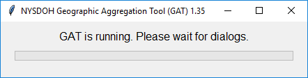
```

Do not close the progress bar before GAT finishes running. If you do, GAT will crash with this error:

```{r tpberror, echo=FALSE}
warning('Error in structure(.External(.C_dotTclObjv, objv), class = "tclObj") : 
  [tcl] bad window path name ".113".')
```


## Step 1. Request aggregation shapefile

This step requests the shapefile from the user using a pop-up dialog. This progress bar will be displayed:

```{r pbshp, out.width = '60%', fig.cap = 'Progress Bar: Identify Shapefile', echo = FALSE}
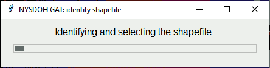
```

### How this step works

```{r shpcode, echo = FALSE, eval = FALSE}
# code to generate window for locateGATshapefile.png
gatpkg::locateGATshapefile()
```

```{r shppic, fig.cap = 'Dialog: Identify Shapefile', echo = FALSE}
knitr::include_graphics("images/locateGATshapefile.png")
```

In this dialog, you can navigate to any shapefile on your computer or network. To follow the steps as shown, navigate to the "extdata" folder in your installation of "gatpkg", which you can reach via your filepath in [Running GAT]. Select the "hftown" shapefile. 

Click `Open` to move to the next step or click `Cancel` to end GAT. 


### About this step

The function [locateGATshapefile()](../html/locateGATshapefile.html) checks that:

* the shapefile uses polygons
* at least one character variable can be used as an area identifier (such as name, geoid, or index)
* at least one numeric variable can be aggregated

If any of these checks fail, you will receive an error message and will be asked to select a new shapefile. The "open file" dialog may not look exactly as shown; sometimes it includes a folder list on the left.

Learn more about the example aggregation shapefile, [hftown](../html/hftown.html).


## Step 2. Request shapefile identifier

This step requests the identifier variable from the user using a pop-up dialog. The ID will be overwritten as areas are aggregated and a crosswalk from these identifiers to the ones produced by GAT will be generated at the end.

```{r pbid, out.width = '60%', fig.cap = 'Progress Bar: Identify Identifier', echo = FALSE}
knitr::include_graphics("images/pb_id.png")
```

### How this step works


```{r idcode, echo = FALSE, eval = FALSE}
# code to generate window for identifyGATid.png
gatpkg::identifyGATid(gatpkg::hftown@data)
```

```{r idpic, fig.cap = 'Dialog: Identify Identifier', echo = FALSE}
knitr::include_graphics("images/identifyGATid.png")
```

In this dialog, select the variable you would like to use from the drop-down list. To follow the steps as shown, select "ID".

Click `Next >` to move to the next step, `< Back` to move to the previous step (selecting a shapefile), `Cancel` to end the program, or `Help` to get further guidance.


### About this step

The function [identifyGATid()](../html/identifyGATid.html) lists only character variables with unique values from the shapefile's DBF. If the identifier you are looking for does not show up, it may either be numeric or contain at least one non-unique value.


## Step 3. Request boundary variable

```{r pbboundary, out.width = '60%', fig.cap = 'Progress Bar: Identify Boundary', echo = FALSE}
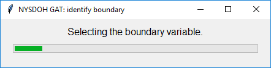
```

This step requests the boundary variable from the user using a pop-up dialog. GAT will aggregate within this boundary first, if possible.

### How this step works

```{r boundarycode, echo = FALSE, eval = FALSE}
# code to generate window for identifyGATboundary.png
gatpkg::identifyGATboundary(data = gatpkg::hftown@data)
```

```{r boundarypic, fig.cap = 'Dialog: Identify Boundary', echo = FALSE}
knitr::include_graphics("images/identifyGATboundary.png")
```

In this dialog, select the variable you would like to use from the drop-down list. If you would like to require that GAT enforces boundaries, click the checkbox as shown in the image. If you do not want to use a boundary, select "NONE" from the drop-down menu. If you select "NONE", the program will ignore whether you checked the box. 

To follow the steps as shown, select "COUNTY" and check the box.

Click `Next >` to move to the next step, `< Back` to move to the previous step (selecting the identifier), `Cancel` to end the program, or `Help` to get further guidance.

### About this step


The function [identifyGATboundary()](../html/identifyGATboundary.html) lists only character variables with at least one non-unique value from the shapefile's DBF. If the boundary you are looking for does not show up, it may either be numeric or contain no non-unique values.


## Step 4. Request aggregation variables


```{r pbaggregator, out.width = '60%', fig.cap = 'Progress Bar: Identify First Aggregator', echo = FALSE}
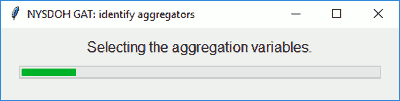
```

This step requests the aggregation variables and their desired minimum and maximum values from the user using a pop-up dialog.

### How this step works


```{r agg1code, echo = FALSE, eval = FALSE}
# code to generate window for identifyGATaggregator1.png
gatpkg::identifyGATaggregators(gatpkg::hftown@data)
```

```{r agg1pic, fig.cap = 'Dialog: Identify First Aggregator', echo = FALSE}
knitr::include_graphics("images/identifyGATaggregators.png")
```

In this dialog, select the variables you would like to aggregate from the drop-down lists. Enter your desired minimum and maximum values for each aggregated area in the text boxes.

To follow the steps as shown, select "TOTAL_POP". Leave the minimum value at "5,000". Change the maximum value to "15,000". Leave all options on the second row as "none".

Click `Next >` to move to the next step, `< Back` to move to the previous step (selecting the boundary variable), `Cancel` to end the program, or `Help` to get further guidance.

### About this step

The function [identifyGATaggregators()](../html/identifyGATaggregators.html) lists only numeric variables from the shapefile's DBF. The value boxes can support numbers, commas, and decimals. 

If you enter any other characters into the value boxes, you will get an error and a new dialog will appear asking you to re-enter the value. If you enter "none" in the value boxes, that triggers default values, which are the minimum value of the selected variable for "minimum value" and the sum of values for the selected variable for "maximum value".


## Step 5. Request exclusion criteria

```{r pb6, out.width = '60%', fig.cap = 'Progress Bar: Identify Exclusion Criteria', echo = FALSE}
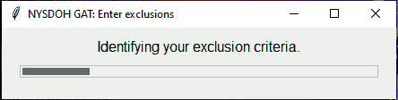
```

This step requests up to three exclusion criteria from the user using a pop-up dialog.

### How this step works


```{r excludecode, echo = FALSE, eval = FALSE}
# code to generate window for inputGATexclusions.png
gatpkg::inputGATexclusions(mapdata = gatpkg::hftown@data, step = 6)
```

```{r excludepic, fig.cap = 'Dialog: Identify Exclusion Criteria', echo = FALSE}
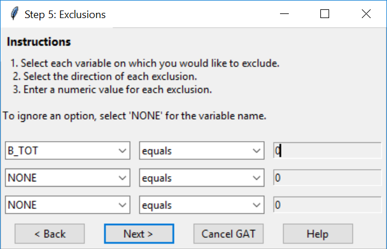
```

In this dialog, select each variable you would like to use to define exclusions from the drop-down lists. For each variable selected, choose a condition and enter a numeric value. Areas meeting any of these criteria will be removed from the aggregation, but retained in the shapefile. If you do not want to use an exclusion criterion, select "NONE" from the drop-down menu. If you select "NONE", the program will ignore the corresponding condition and value. 

To follow the steps as shown, select "B_TOT". Leave the condition as "equals" and the value as "0". Leave the other two criteria as "NONE". 

Click `Next >` to continue, `< Back` to move to the previous step (selecting the second aggregation variable), `Cancel` to end the program, or `Help` to get further guidance.

You will get the following confirmation dialog. 

```{r excludepic2, fig.cap = 'Dialog: Identify Exclusion Criteria', echo = FALSE}
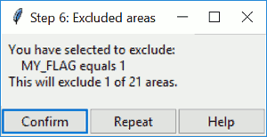
```

Click `Yes` to move to the next step, `< Back` to move to the previous step (selecting the merge method), `Repeat` to return to the exclusion criteria, or `Help` to get further guidance.


### About this step


The function [inputGATexclusions()](../html/inputGATexclusions.html) lists only numeric variables from the shapefile's DBF and the option "NONE". The value dialog can support numbers, commas, and decimals. If you enter any other characters into the value box, you will get an error and a new dialog will appear asking you to re-enter the value. You will also get an error message and a request to reselect criteria if you exclude all areas or all except one area.


## Step 6. Request merge type

This step requests the merge method from the user using a pop-up dialog.

```{r pb7, out.width = '60%', fig.cap = 'Progress Bar: Identify Merge Type', echo = FALSE}
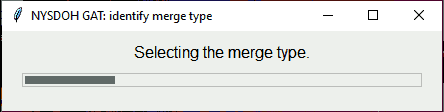
```

### How this step works


```{r mergecode, echo = FALSE, eval = FALSE}
# code to generate window for inputGATmergepop.png
gatpkg::inputGATmergepop(mapdata = gatpkg::hftown@data, aggvar = "TOTAL_POP", aggvar2 = "NONE")
```

```{r mergepic, fig.cap = 'Dialog: Identify Merge Type', echo = FALSE}
knitr::include_graphics("images/inputGATmergepop.png")
```

In this dialog, select the method you would like to use to aggregate areas. If you select any option other than "closest area by population-weighted centroid", geographic centroid will be used. Drop-downs are ignored for options that are not selected.

To follow the steps as shown, select "closest area" and choose "population-weighted" from the drop-down. 

Click `Next >` to move to the next step, `< Back` to move to the previous step (selecting the exclusion criteria), `Cancel` to end the program, or `Help` to get further guidance.

### About this step

The function [inputGATmerge()](../html/inputGATmerge.html) lists only numeric variables from the shapefile's DBF for the ratio drop-downs. The ratio denominator (second list) lists only numeric variables without zero or missing values after removing exclusion criteria.

## Step 7. Request population shapefile

```{r pb8, out.width = '60%', fig.cap = 'Progress Bar: Identify Population Shapefile', echo = FALSE}
knitr::include_graphics("images/pb_loadpop.png")
```

This step requests the population shapefile from the user using a pop-up dialog. If you select an option other than "closest population weighted centroid" in the previous dialog, this step is skipped.

### How this step works


```{r popcode, echo = FALSE, eval = FALSE}
# code to generate window for locateGATshapefile2.png
gatpkg::locateGATshapefile(type = "population", myfile = paste0(filepath, "hfblock"))
```

```{r poppic, fig.cap = 'Dialog: Identify Population Shapefile', echo = FALSE}
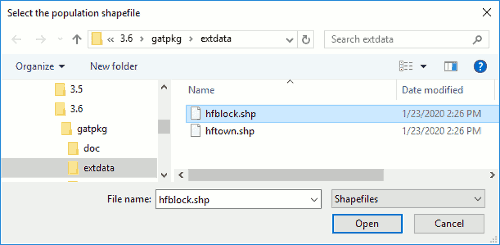
```

In this dialog, you can navigate to any shapefile on your computer or network. 

To follow the steps as shown, navigate to the "extdata" folder in your installation of "gatpkg", if it does not open automatically. Select the "hfblock" shapefile. 

Click "Open" to move to the next step or click "Cancel" to go back to the merge selection dialog. 

If there are multiple numeric variables, you will get a dialog requesting that you select one. If there is only one suitable variable, you will get this message:

```{r poppic2, fig.cap = 'Dialog: Identify Population Shapefile', echo = FALSE}
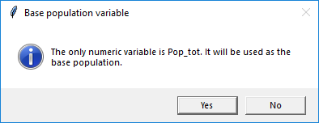
```

Click "Yes" to continue or "No" to return to the previous step (selecting the merge method).

### About this step

You can select the same file for both aggregating and population weighting. GAT treats them as two separate objects, so you will still have to identify the population variable for the new object. 

The shapefiles' areas do not need to line up (for example, census tracts within counties) because the population weighting intersects the population object with the aggregation object and assigns population to intersected areas based on the proportion of each population area that falls inside each area to aggregate.

If a population file does not cover the full extent of the areas to aggregate, geographic centroids will be used for areas that cannot be assigned population-weighted coentroids. You will not get a warning if this occurs, so please check your shapefiles before reading them into GAT.


*Note to self: Add the "pick a variable" dialog to select the population variable.*

Learn more about the example population shapefile, [hfblock](../html/hfblock.html).


## Step 8. Request rate calculation information

```{r pb9, out.width = '60%', fig.cap = 'Progress Bar: Identify Rate Settings', echo = FALSE}
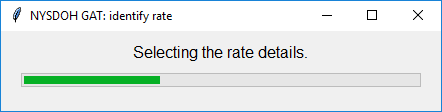
```

This step requests the rate calculation information from the user using a pop-up dialog.

### How this step works

```{r ratecode, echo = FALSE, eval = FALSE}
# code to generate window for inputGATrate.png
gatpkg::inputGATrate(mapdata = gatpkg::hftown@data, limitdenom = FALSE)
```

```{r ratepic, fig.cap = 'Dialog: Identify Rate Settings', echo = FALSE}
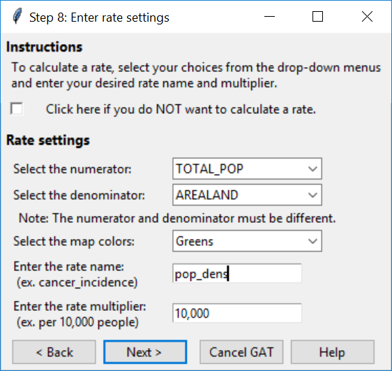
```

In this dialog, select the numerator, denominator, and map color scheme from the drop-downs. Enter a rate name and multiplier value. If you check "Do NOT calculate a rate" at the top, all other options are ignored.

To follow the steps as shown, select "TOTAL_POP" for the numerator, "AREALAND" for the denominator, and "Greens" for the map color scheme. Name your rate variable "pop_dens" and leave the multiplier as "10,000".

Click `Next >` to move to the next step, `< Back` to move to the previous step (locating the population shapefile), `Cancel` to end the program, or `Help` to get further guidance.

You will get a confirmation message stating either your selections or that you chose not to calculate a rate. 

```{r ratepic2, fig.cap = 'Dialog: Identify Rate Settings', echo = FALSE}
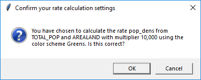
```

Click "OK" to continue or "Cancel" to retrn to the rate selection dialog.


### About this step

The function [inputGATrate()](../html/inputGATrate.html) lists only numeric variables from the shapefile's DBF for the numerator and denominator drop-downs. The denominator lists all numeric variables, but can be modified to list only numeric variables without zero or missing values, after removing exclusion criteria. 

The rate name uses the same convention as SAS variable naming, which starts with a letter or underscore and allows only letters, underscores, and numbers. All other characters will be removed from the rate name. The rate name "no_rate" is used when rate will not be calculated, so do not use this name. 

The multiplier box can support numbers, commas, and decimals. If you enter any other characters into the multiplier box, you will get an error and a new dialog will appear asking you to re-enter the multiplier. To calculate a ratio, set the multiplier to 1. 

This step is not required. Check the box beside "Do NOT calculate a rate" if you want to skip rate calculation. 


If you choose *not* to calculate a rate, you will see this confirmation dialog. 

```{r idrateno, out.width = '40%', fig.cap = 'Dialog: Confirm No Rate', echo = FALSE}
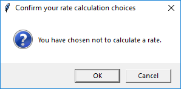
```

## Step 9. Request whether to save KML file

```{r pb10, out.width = '60%', fig.cap = 'Progress Bar: Save KML', echo = FALSE}
knitr::include_graphics("images/pb_pickkml.png")
```

This step asks whether the user wants to save a KML file using a pop-up dialog.

### How this step works

```{r kmlcode, echo = FALSE, eval = FALSE}
# code to generate window for saveGATkml.png
gatpkg::saveGATkml()
```

```{r kmlpic, fig.cap = 'Dialog: Save KML', echo = FALSE}
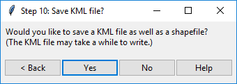
```

In this dialog, select "Yes" or "No". 

To follow the steps as shown, select "No". 

Click `Yes` or `No` to move to the next step, `< Back` to move to the previous step (selecting the rate settings), or `Help` to get further guidance.

### About this step

The function [saveGATkml()](../html/saveGATkml.html) requests a simple "yes" or "No". To end GAT from here, click the "x" in the upper right corner. While a KML file is optional, a shapefile is saved by default.

## Step 10. Request where to save shapefile

```{r pb11, out.width = '60%', fig.cap = 'Progress Bar: Save File', echo = FALSE}
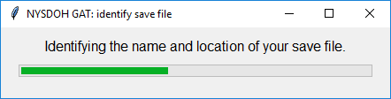
```

This step requests where to save the shapefile from the user using a pop-up dialog.

### How this step works

```{r savecode, echo = FALSE, eval = FALSE}
# code to generate window for saveGATfiles.png
gatpkg::saveGATfiles()
```


```{r savepic, fig.cap = 'Dialog: Save File', echo = FALSE}
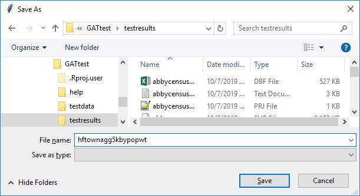
```

In this dialog, you can navigate to any folder on your computer or network. 

To follow the steps as shown, navigate to the "extdata" folder in your installation of "gatpkg". Enter "hftownagg5kbypopwt". 

Click "Save" to move to the next step or click "Cancel" to end GAT. 

### About this step

The function [saveGATfiles()](../html/saveGATfiles.html) checks if the name you provide already exists. If so, it asks if you want to overwrite. All files created will be saved here, with this filename (including log, plots, and KML, if requested).


## Step 11. Request settings confirmation

This step requests confirmation of all settings from the user using a pop-up dialog.

```{r pb12, out.width = '60%', fig.cap = 'Progress Bar: Confirm GAT Settings', echo = FALSE}
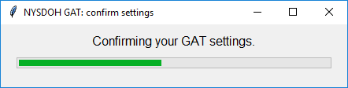
```

### How this step works


```{r confirmcode, echo = FALSE, eval = FALSE}
# code to generate window for locateGATshapefile.png
gatvars <- list(aggregator1 = "TOTAL_POP", aggregator2 = "TOTAL_POP",
                myidvar = "ID", minvalue1 = 5000, minvalue2 = 5000,
                boundary = "COUNTY", rigidbound = TRUE, popvar = "Pop_tot")
mergevars <- list(mergeopt1 = "closest", similar1 = "AREALAND", 
                  similar2 = "AREALAND", centroid = "population-weighted")
ratevars <- list(ratename = "pop_dens", numerator = "TOTAL_POP", 
                 denominator = "AREALAND", multiplier = 10000)
exclist <- list(var1 = "B_TOT", var2 = "NONE", var3 = "NONE", 
                math1 = "equals", math2 = "equals", math3 = "equals", 
                val1 = 0, val2 = 0, val3 = 0, flagsum = 6)
filevars <- list(filein = "hftown", popfile = "hfblock", 
                 fileout = "hftownagg5kbypopwt")

gatpkg::confirmGATbystep(gatvars = gatvars, ratevars = ratevars, 
                       mergevars = mergevars, exclist = exclist, 
                       filevars = filevars, savekml = FALSE, step = 11, 
                       numrow = nrow(gatpkg::hftown@data))
```


```{r confirmpic, fig.cap = 'Dialog: Confirm GAT Settings', echo = FALSE}
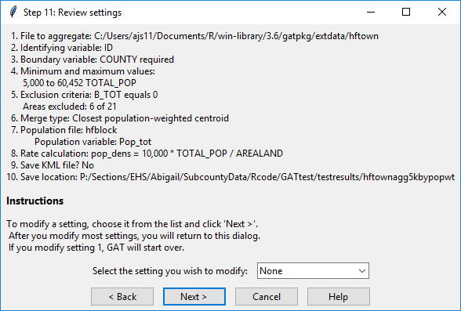
```

In this dialog, you can select a step to modify or move on. To modify steps, select the first step you want to modify from top to bottom. After each modification, you will return to this dialog to select the next step. If you choose to move on, click `Next >` to move to the next step, `< Back` to move to the previous step (selecting the rate settings), `Start over` to start from the beginning, or `Help` to get further guidance. To follow the steps as shown, click `Next >`.


### About this step

The function [confirmGATbystep()](../html/confirmGATbystep.html) requests a simple `Yes` or `No`. To end GAT from here, click the "x" in the upper right corner.


# Shapefile processing section

If the user has not cancelled the program, at this point, the shapefile processing begins.

*Note to self: Clean up everything below this point.*


## Step 12. Read shapefile

```{r pb13, out.width = '60%', fig.cap = 'Progress Bar: Read the Shapefile', echo = FALSE}
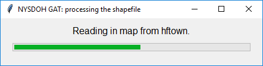
```

The first processing step is to read in the shapefile. In this step, R creates a SpatialPolygonsDataFrame object, reads its projection, and calculates the geographic centroid for each polygon. Then GAT creates a flag variable to apply exclusion criteria to relevant polygons based on the exclusions and maximum values that you selected.


### About this step

This step was already done in the user input section to assess the shapefile's suitability for aggregating, but the shapefile was not retained in memory at that point.


## Step 13. Run aggregation loop

```{r pb14, out.width = '60%', fig.cap = 'Progress Bar: Run the Aggregation', echo = FALSE}
knitr::include_graphics("images/pb_doagg.png")
```


This is the second processing step and probably the slowest step in the entire program, especially if you select population weighting. It opens a new progress bar specifically for the aggregation loop. This progress bar updates with the number of areas left to aggregate as each aggregation completes, then closes when the loop finishes.

### About this step

This step calls the function [defineGATmerge()](../html/defineGATmerge.html) to create the aggregation key or crosswalk. It creates a subset of polygons for which their value for the aggregation variable(s) is below your minimum desired aggregation value(s). It reorders the subset from largest to smallest aggregation value. Starting with the largest value, it determines acceptable neighbors for aggregation based on your settings.


## Step 14. Aggregate areas

```{r pb15, out.width = '60%', fig.cap = 'Progress Bar: Clean Up the Shapefile', echo = FALSE}
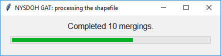
```


This is the third processing step, which aggregates areas as defined by the crosswalk created in Step 13. If you requested rates, they are calculated in this step.

### About this step

This step calls the function [mergeGATareas()](../html/mergeGATareas.html) to perform the aggregation. It also cleans up row names and other information that may not have been properly retained during the aggregation. 

## Step 15. Calculate compactness ratio

```{r pb16, out.width = '60%', fig.cap = 'Progress Bar: Calculate GAT Compactness Ratio', echo = FALSE}
knitr::include_graphics("images/pb_cratio.png")
```


This step creates a new compactness ratio variable that is added to the aggregated shapefile's dataset.

### About this step

This step runs the function [calculateGATcompactness()](../html/calculateGATcompactness.html).

# Mapping section

This section contains the maps that are created by GAT. The final PDF will contain between four and seven maps, depending on your selections. Given all seven maps:

- **Maps 1 & 2:** Choropleths of the first aggregation variable before and after aggregating.
- **Maps 3 & 4:** Choropleths of the second aggregation variable before and after aggregating (optional).
- **Map 5:** Comparison of original and aggregated areas.
- **Map 6:** Choropleth of the compactness ratio after aggregating.
- **Map 7:** Choropleth of the rate, ratio, or density defined in the rate selection (optional).


## Step 16. Map first aggregation variable

```{r pb17, out.width = '60%', fig.cap = 'Progress Bar: Map First Aggregation Variable', echo = FALSE}
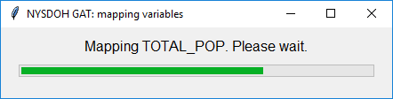
```

Two choropleth maps are produced in this step. The two maps use the same color scale and range, which should make comparisons easy. 

- **Left map:** distribution of the aggregation variable *before* aggregating. 
- **Right map:** distribution of the aggregation variable *after* aggregating. 

```{r mapa1, out.width = '45%', fig.show = "hold", fig.cap = 'Maps: First Aggregation Variable Before and After Aggregating', echo = FALSE}
knitr::include_graphics(c("images/map_before.png","images/map_after.png"))
```

### About this step

This step calls the function [plotGATmaps()](../html/plotGATmaps.html) to draw the map.


## Step 17. Map second aggregation variable

```{r pb18, out.width = '60%', fig.cap = 'Progress Bar: Map Second Aggregation Variable', echo = FALSE, eval = FALSE}
knitr::include_graphics("images/pb18.png")
```

If you selected a second aggregation variable, two choropleth maps are produced in this step. One map shows the distribution of the second aggregation variable before aggregating and the other shows the distribution after aggregating. 

### About this step

This step calls the function [plotGATmaps()](../html/plotGATmaps.html) to draw the map.


## Step 18. Map comparison of old and new areas

```{r pb19, out.width = '60%', fig.cap = 'Progress Bar: Compare Original and Aggregated Areas', echo = FALSE}
knitr::include_graphics("images/pb_mapdiff.png")
```

In this map, the aggregated area map is overlaid on top of the original map so you can see how smaller areas combined into larger ones.

```{r mapca, fig.show = "hold", out.width = '90%', fig.cap = 'Map: Compare Original and Aggregated Areas', echo = FALSE}
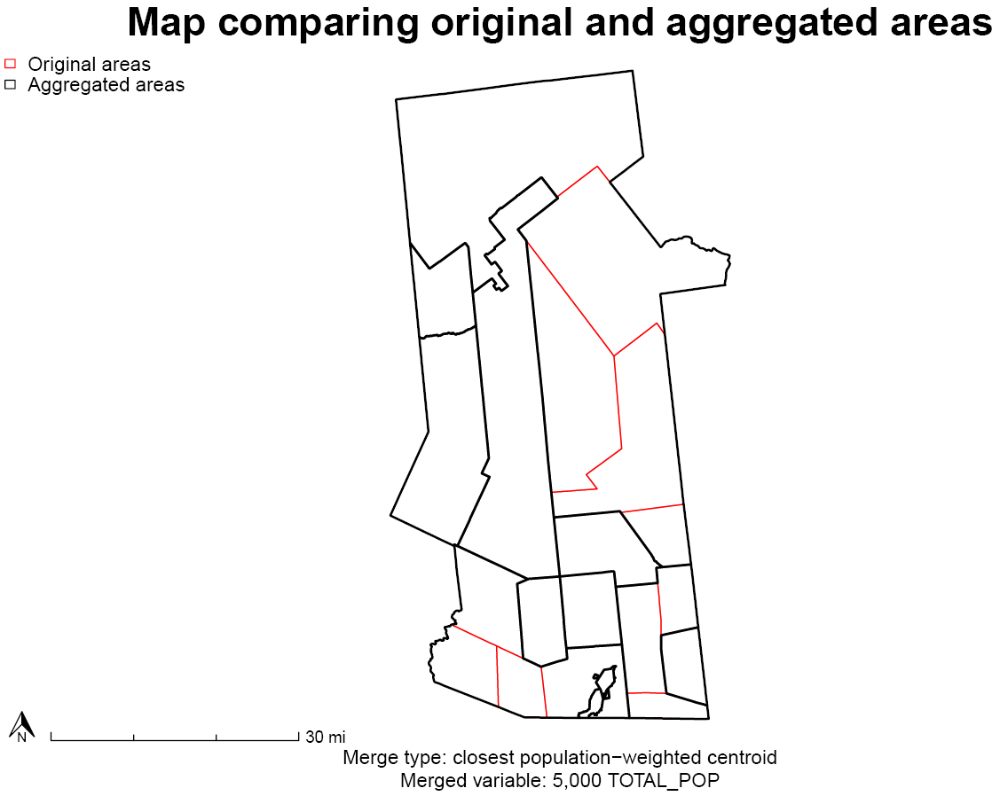
```
### About this step

This step calls the function [plotGATcompare()](../html/plotGATcompare.html) to draw the map.

## Step 19. Map compactness ratio

```{r pb20, out.width = '60%', fig.cap = 'Progress Bar: Map GAT Compactness Ratio', echo = FALSE}
knitr::include_graphics("images/pb_mapcr.png")
```

This map displays a choropleth scale of the compactness ratios for the aggregated areas.

```{r mapcr, fig.show = "hold", out.width = '90%', fig.cap = 'Map: Compactness Ratio', echo = FALSE}
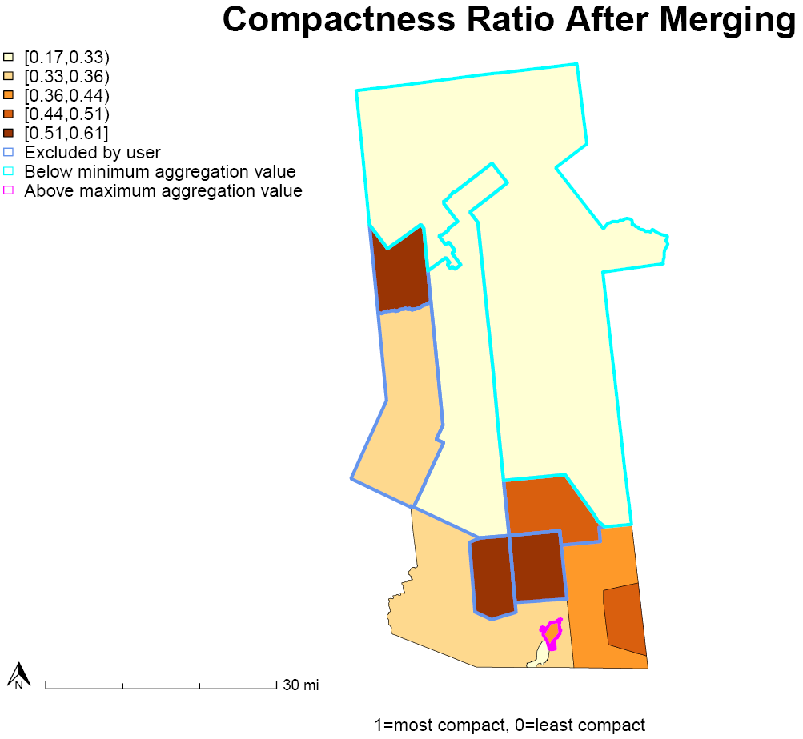
```
### About this step

This step calls the function [plotGATmaps()](../html/plotGATmaps.html) to draw the map.


## Step 20. Map rate


```{r pb21, out.width = '60%', fig.cap = 'Progress Bar: Map Your Desired Rate', echo = FALSE}
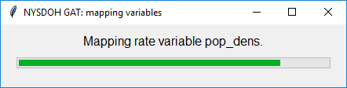
```

This map displays a choropleth scale of whatever rate or ratio you decided to calculate. It also includes the rate function and summary statistics.

```{r mapr, fig.show = "hold", out.width = '90%', fig.cap = 'Map: Choropleth of Rate for Aggregated Areas', echo = FALSE}
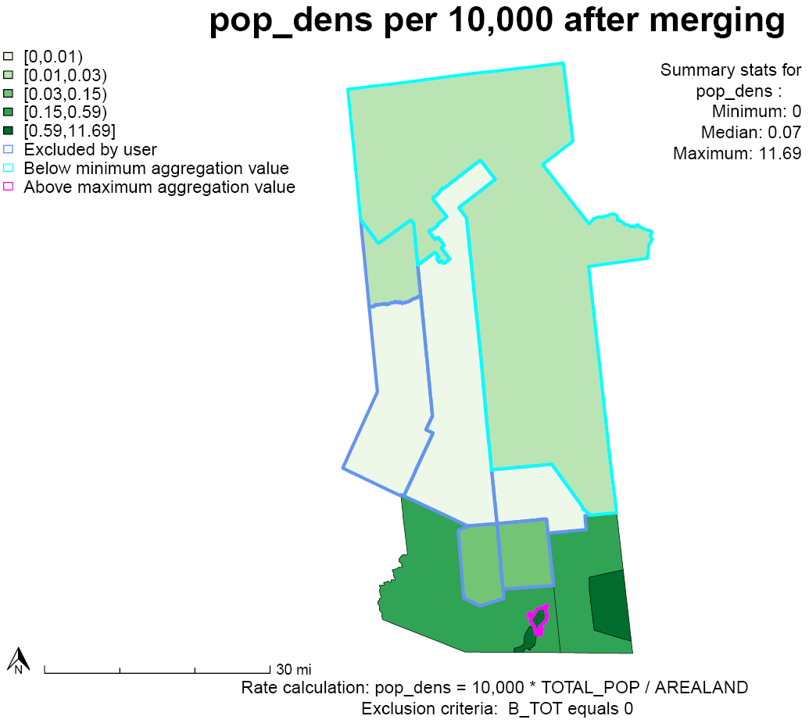
```
### About this step

This step calls the function [plotGATmaps()](../html/plotGATmaps.html) to draw the map.


# File saving section

This section contains the file saving steps. 


## Step 21. Save original shapefile

```{r pbold, out.width = '60%', fig.cap = 'Progress Bar: Save the Original Shapefile', echo = FALSE}
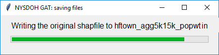
```

In this section, the original shapefile is saved with the following changes:

- It is renamed to match the save filename you selected with "in" at the end and saved in the same folder as the aggregated shapefile.
- The aggregation key or crosswalk and flag variable are appended to its dataframe.

Files saved to the save folder if you followed the vignette:

- hftown_agg5k15k_popwtin.dbf 
- hftown_agg5k15k_popwtin.prj 
- hftown_agg5k15k_popwtin.shp 
- hftown_agg5k15k_popwtin.shx 

## Step 22. Save aggregated shapefile

```{r pbnew, out.width = '60%', fig.cap = 'Progress Bar: Save the Aggregated Shapefile', echo = FALSE}
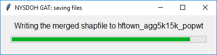
```

In this section, the aggregated shapefile is saved. 

Files saved to the save folder if you followed the vignette:

- hftown_agg5k15k_popwt.dbf 
- hftown_agg5k15k_popwt.prj 
- hftown_agg5k15k_popwt.shp 
- hftown_agg5k15k_popwt.shx 


## Step 23. Save maps

```{r pbmaps, out.width = '60%', fig.cap = 'Progress Bar: Save a PDF of the maps', echo = FALSE}
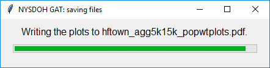
```

In this section, all maps are saved to PDF in the same folder as the aggregated shapefile. The same save filename is used with "plots" at the end.

File saved to the save folder if you followed the vignette:

- hftown_agg5k15k_popwtplots.pdf (containing 5 maps)


## Step 24. Save KML file

```{r pbkml, out.width = '60%', fig.cap = 'Progress Bar: Save the KML File', echo = FALSE}
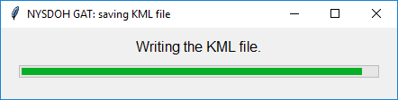
```

In this step, nothing happens if you are following the vignette and selected no when asked if you wanted to save a KML file. If you had selected yes, a KML file would be created in this step that could then be opened in Google Earth. 

Files saved to the save folder, if "Yes" selected:

- hftown_agg5k15k_popwt.kml 


## Step 25. Save log

```{r pblog, out.width = '60%', fig.cap = 'Progress Bar: Save the Log of Your Run', echo = FALSE}
knitr::include_graphics("images/pb_log.png")
```

In this step, a text file is saved that includes all of your settings, basic information on data distributions for the aggregation variable(s), and warnings regarding possible issues with the aggregation. 

An Rdata file is also saved. This file includes all settings in R format, which can be opened in R or run through GAT a second time. If you want to use the Rdata file to re-run GAT, use this code and change `myfilepath` to the location and name of your Rdata file:

```{r rerun, eval = FALSE}
myfilepath <- "C:/users/ajs/mygatfilesettings.Rdata"
gatpkg::runGATprogram(settings = myfilepath)

```

Files saved to the save folder if you followed the vignette:

- hftown_agg5k15k_popwt.log
- hftown_agg5k15k_popwtsettings.Rdata


# GAT is finished, now what?

## Where to find your files

All files are saved to the save folder you selected. The log file contains a partial list of files created. The R console will display a full list of all files created and their location when the aggregation is complete, which will look something like this:

```{r, eval = FALSE}
The following files have been written to the folder 
C:/Users/ajs11/Documents/GAT: 
  hftown_agg5k15k_popwt.dbf 
  hftown_agg5k15k_popwt.prj 
  hftown_agg5k15k_popwt.shp 
  hftown_agg5k15k_popwt.shx 
  hftown_agg5k15k_popwtin.dbf 
  hftown_agg5k15k_popwtin.prj 
  hftown_agg5k15k_popwtin.shp 
  hftown_agg5k15k_popwtin.shx 
  hftown_agg5k15k_popwtplots.pdf 
  hftown_agg5k15k_popwt.log 
  hftown_agg5k15k_popwtsettings.Rdata 
  
See the log file for more details.
```

## How to use your files

- **Shapefiles:** Open in ArcGIS, QGIS, or similar GIS software. 
- **KML file:** Open in Google Earth desktop or online.
- **PDF file:** Open in any PDF reader.
- **Log file:** Open in any text editor, such as Notepad++.
- **Rdata file:** Open in R using `load("C:/filepath/settings.Rdata")`.

